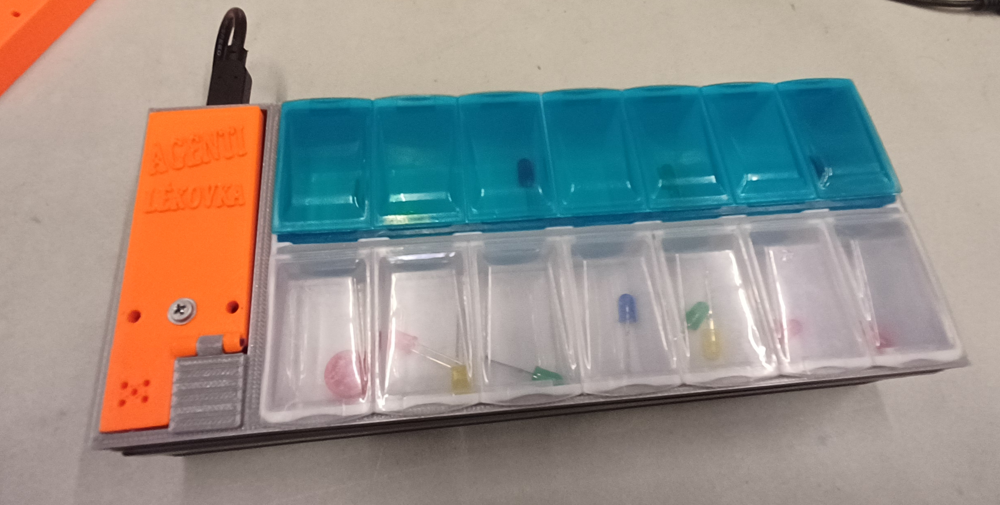
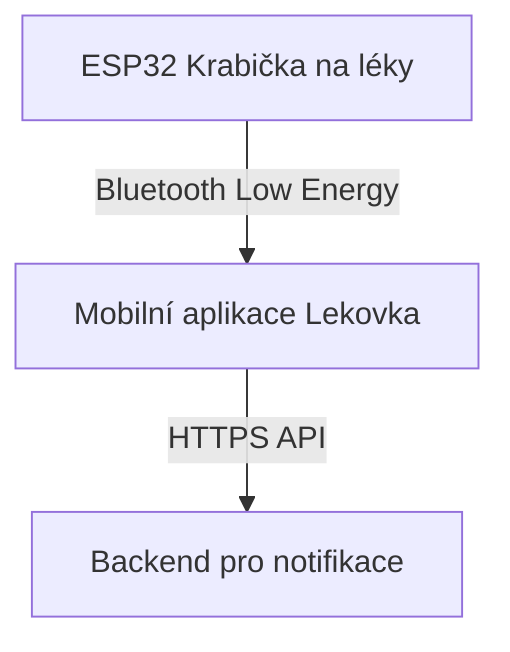
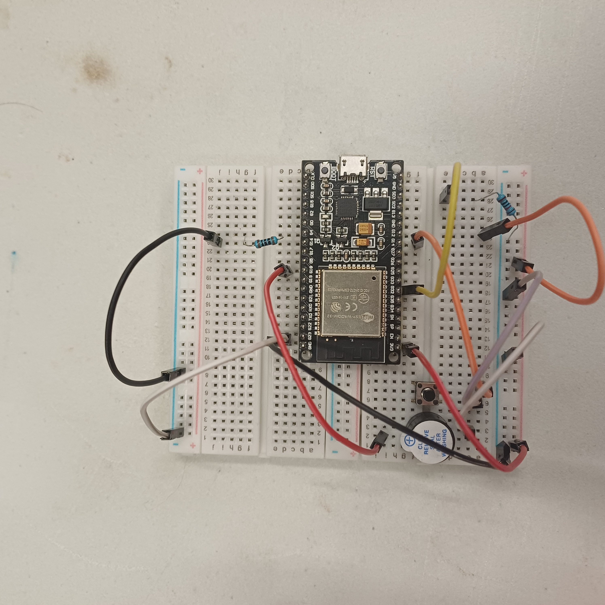
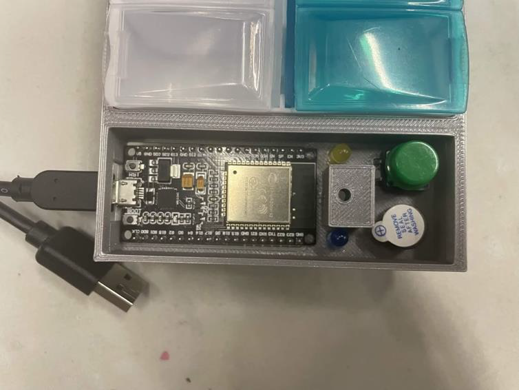
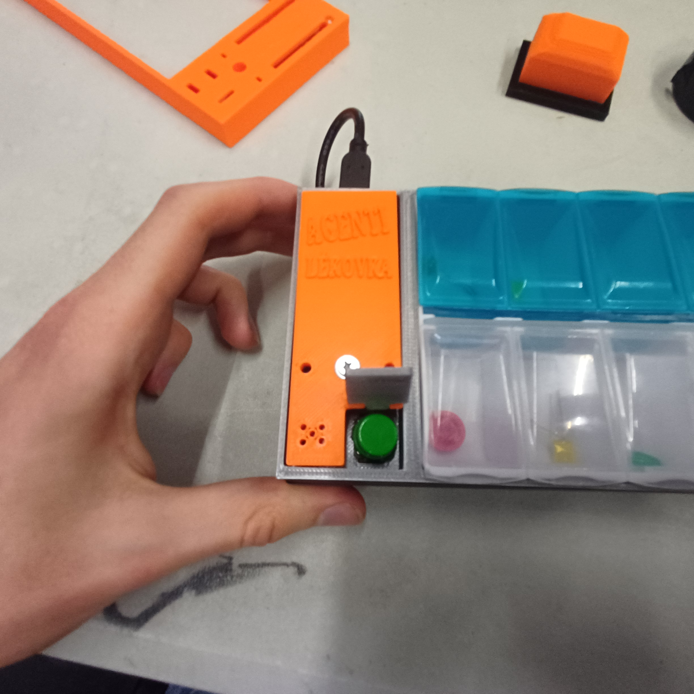

# esp32-medication-box

  
   
  <em>Finální produkt</em>

Tento projekt vznikl v rámci hackathonu Aimtec 2026. Jedná se o chytrou krabičku na léky postavenou na platformě ESP32.

## O projektu

Cílem projektu je pomoci uživatelům s pravidelným užíváním léků. Krabička v nastavené časy upozorní na nutnost vzít si lék a sleduje, zda si ho uživatel skutečně vzal. Stav je synchronizován s mobilní aplikací přes Bluetooth.

## Klíčové vlastnosti

- **Plánování léků:** Možnost nastavení časů pro užívání léků.
- **Notifikace:** Zvukové a vizuální upozornění přímo na krabičce.
- **Sledování užívání:** Potvrzení užití prášku je signalizováno pomocí stisknutí tlačítka na chytré krabičce na léky.
- **Bluetooth komunikace:** Propojení s mobilní aplikací pro správu, přehled, SMS notifikace, email notifikace a další.
- **Offline režim:** Krabička funguje i bez připojení k telefonu.

## Hardware

- **Řídící jednotka:** ESP32
- **Indikace:** Buzzer a dvě LED diody (žlutá = vzal sis prášek ráno, modrá = vzal sis prášek večer)
- **Ovládání:** Tlačítko

## Software a integrace

Projekt je vyvíjen v **C++** s využitím ekosystému **PlatformIO**, který představuje sadu nástrojů pro zjednodušení vývoje pro vestavěná zařízení.

### Struktura projektu

- `src/`: Hlavní zdrojové kódy aplikace.
  - `main.cpp`: Vstupní bod programu.
  - `bluetooth_service.cpp`: Zajišťuje komunikaci přes Bluetooth Low Energy (BLE).
  - `pills_tracker.cpp`: Logika pro sledování a plánování užívání léků.
  - `time_manager.cpp`: Správa času a synchronizace.
  - `eeprom_service.cpp`: Ukládání dat do EEPROM paměti.
  - `Buzzer.cpp` & `Button.cpp`: Ovládání hardwarových komponent.
- `include/`: Hlavičkové soubory.
- `lib/`: Knihovny třetích stran.
- `platformio.ini`: Konfigurační soubor pro PlatformIO.

## Architektura systému

Architektura celého řešení je postavena na třech hlavních pilířích:

1. **Hardware (tento projekt)**: Chytrá krabička na léky s ESP32.
2. **Mobilní aplikace**: Slouží jako rozhraní pro uživatele.
3. **Backend server**: Zajišťuje zasílání notifikací.

Komunikace probíhá tak, že hardwarové zařízení posílá data přes Bluetooth do mobilní aplikace. Ta následně komunikuje s backendem pro zajištění pokročilých funkcí, jako je odesílání SMS nebo emailových notifikací.

## Mobilní aplikace

Pro plnou funkcionalitu je potřeba mobilní aplikace, která je dostupná zde:
[Lekovka - Mobilní aplikace](https://github.com/JakubPavlicek/Lekovka)

## Backend

Pro zasílání notifikací (SMS, email) je využíván backend dostupný zde:
[it-is-one.GO - Backend](https://github.com/vjelinekk/it-is-one.GO)

## Obrázky projektu

  
   
  <em>Prototyp na nepájivém poli</em>

  
   
  <em>Ukázka detailu součástek v krabičce</em>

  
   
  <em>Ukázka krytu tlačítka pro zamezení nechtěného stistknutí</em>

